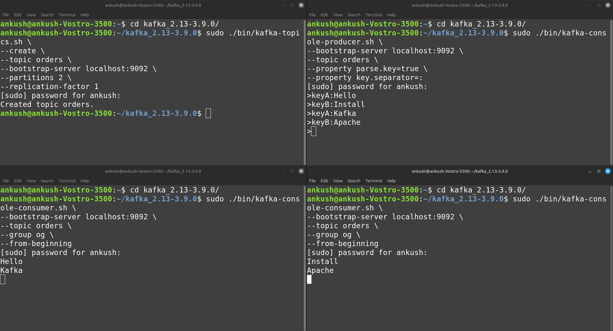

# Apache-Kafka-setup
This guide provides a step-by-step process to install and configure Apache Kafka on a Linux system, including both Zookeeper-based and KRaft (Kafka Raft) mode.

Visit the official [Apache Kafka Website](https://kafka.apache.org/downloads)


# Apache Kafka Setup Guide

## Step 1: Install Kafka

### 1.1 Download Kafka

Visit the official Apache Kafka website.
Select the latest binary version (e.g., kafka_2.13-3.9.0.tgz).
Copy the download link of the selected version.

### 1.2 Download Kafka using Terminal (Linux Users)
1. Open a Terminal.
2. Use the `wget` command to download Kafka:

   ```bash
   wget <Kafka_download_link>
   ```
   *(Replace `<Kafka_download_link>` with the actual link from the Kafka website.)*

3. After downloading, list the files to confirm:
   ```bash
   ls
   ```

### 1.3 Extract the Kafka Archive
1. Extract Kafka, which comes in a compressed `.tgz` format:
   ```bash
   sudo tar -xvf kafka_2.13-3.9.0.tgz
   ```
2. Navigate into the extracted Kafka directory:
   ```bash
   cd kafka_2.13-3.9.0
   ```

---

## Step 2: Understanding Kafka Directory Structure
Inside the `kafka_2.13-3.9.0` folder, you will find multiple directories:
- `bin/` → Contains all Kafka-related scripts (to start/stop services).
- `config/` → Holds configuration files for Kafka and Zookeeper.
- `logs/` → Stores logs of Kafka processes.

We mainly work with `bin/` and `config/`.

---

## Step 3: Start Kafka with Zookeeper
Kafka requires **Zookeeper** for managing brokers, partitions, and leader elections.  
We must start Zookeeper before starting Kafka.

### 3.1 Start Zookeeper
1. Open ***New Terminal*** and navigate to the Kafka directory:
   ```bash
   cd kafka_2.13-3.9.0
   ```
2. Start Zookeeper with:
   ```bash
   sudo ./bin/zookeeper-server-start.sh ./config/zookeeper.properties
   ```

This starts Zookeeper in the background.

### 3.2 Start Kafka Server
1. Open **New Terminal** and navigate to the Kafka directory:
   ```bash
   cd kafka_2.13-3.9.0
   ```
2. Start the Kafka server:
   ```bash
   sudo ./bin/kafka-server-start.sh ./config/server.properties
   ```

At this point, Kafka is up and running with Zookeeper, meaning both are functioning without any errors. You can now close both terminals and proceed to step 4.

---

## Step 4: Start Kafka with Kraft (Alternative)
Kafka without Zookeeper uses **Kraft** (Kafka Raft metadata mode).  
This is faster and easier because both Kafka and metadata management work together.

### 4.1 Generate a Unique Cluster ID
1. Open a Terminal and navigate to the Kafka directory:
   ```bash
   cd kafka_2.13-3.9.0
   ```
2. Run the following command to generate a unique UUID (Cluster ID):
   ```bash
   sudo bin/kafka-storage.sh random-uuid
   ```
3. Copy the generated UUID for the next step.

### 4.2 Format Storage Directory
1. Format the Kafka storage directory with the generated UUID:
   ```bash
   sudo bin/kafka-storage.sh format -t <UUID> -c config/kraft/server.properties
   ```
   *(Replace `<UUID>` with the UUID from the previous step.)*

### 4.3 Start Kafka Server (with Kraft)
1. Start Kafka in Kraft mode with:
   ```bash
   sudo bin/kafka-server-start.sh config/kraft/server.properties
   ```

This eliminates the need for Zookeeper. Now, Kafka runs in Kraft mode using a single command.
Now, you have successfully installed and set up Kafka on Linux using both Zookeeper and KRaft mode.

---

---

# Kafka Practical Guide: Creating and Using Topics

--

This guide explains step-by-step how to create topics in Apache Kafka, send messages, and consume them using **producers** and **consumers**. We will cover two exercises:

1. **Creating a simple Kafka topic** and sending/receiving messages.
2. **Creating a Kafka topic with multiple partitions** and demonstrating message distribution.

---

Before starting the exercise, you need to ensure that your Kafka server (with Kraft) is running continuously. You can do this by executing the following command:
   ```bash
   sudo bin/kafka-server-start.sh config/kraft/server.properties
   ```
---

## Exercise 1: Creating and Testing a Simple Kafka Topic

### Step 1: Create a Kafka Topic

1. Open a terminal and navigate to the Kafka directory:
   ```bash
   cd kafka_2.13-3.9.0
   ```
2. Run the following command to create a topic named **test-topic**:
   ```bash
   sudo ./bin/kafka-topics.sh \
   --create \
   --topic <topic-name> \
   --bootstrap-server localhost:9092 \
   --partitions 1 \
   --replication-factor 1
   ```
3. If the topic is successfully created, you will see:
   ```bash
   Created topic <your-topic-name>.
   ```

---

### Step 2: Sending and Receiving Messages in Kafka

We will now test the Kafka topic using a **producer** (to send messages) and a **consumer** (to receive messages).

#### 1st Terminal - Start the Producer
1. Open a new terminal and navigate to the Kafka directory:
   ```bash
   cd kafka_2.13-3.9.0
   ```
2. Start the Kafka **producer**:
   ```bash
   sudo ./bin/kafka-console-producer.sh \
   --bootstrap-server localhost:9092 \
   --topic <topic-name>
   ```
3. After running this command, the terminal will wait for input. Type some messages:
   ```
   Hi
   Hello Everyone
   ```

#### 2nd Terminal - Start the Consumer
1. Open another terminal and navigate to the Kafka directory:
   ```bash
   cd kafka_2.13-3.9.0
   ```
2. Start the Kafka **consumer** to listen for messages:
   ```bash
   sudo ./bin/kafka-console-consumer.sh \
   --bootstrap-server localhost:9092 \
   --topic <topic-name> \
   --from-beginning
   ```
3. The consumer will display the messages that were sent from the **producer terminal**:
   ```
   Hi
   Hello Everyone
   ```

---

## Exercise 2: Creating and Testing a Kafka Topic with Multiple Partitions

In this exercise, we will:
1. Create a Kafka topic named **orders** with **two partitions**.
2. Use **one producer** to send messages.
3. Use **two consumers** to read messages distributed between partitions.

---

### Step 1: Create a Kafka Topic with 2 Partitions

1. Open a terminal and navigate to the Kafka directory:
   ```bash
   cd kafka_2.13-3.9.0
   ```
2. Run the following command to create a topic named **orders** with 2 partitions:
   ```bash
   sudo ./bin/kafka-topics.sh \
   --create \
   --topic <topic-name> \
   --bootstrap-server localhost:9092 \
   --partitions 2 \
   --replication-factor 1
   ```
3. If the topic is successfully created, you will see:
   ```
   Created topic orders.
   ```

---

### Step 2: Sending and Receiving Messages Using Multiple Consumers

#### 1st Terminal - Start the Producer
1. Open a new terminal and navigate to the Kafka directory:
   ```bash
   cd kafka_2.13-3.9.0
   ```
2. Start the Kafka **producer**:
   ```bash
   sudo ./bin/kafka-console-producer.sh \
   --bootstrap-server localhost:9092 \
   --topic <topic-name> \
   --property parse.key=true \
   --property key.separator=:
   ```
3. Now, send messages using **keys** to distribute them across partitions:
   ```
   keyA:Hello
   keyB:Install
   keyA:Kafka
   keyB:Apache
   ```

---

#### 2nd Terminal - Start Consumer 1
1. Open another terminal and navigate to the Kafka directory:
   ```bash
   cd kafka_2.13-3.9.0
   ```
2. Start a **consumer** connected to the topic and **consumer group og**:
   ```bash
   sudo ./bin/kafka-console-consumer.sh \
   --bootstrap-server localhost:9092 \
   --topic <topic-name> \
   --group <group-name> \
   --from-beginning
   ```
3. This consumer will receive messages from **one partition**, so it may show:
   ```
   Hello
   Kafka
   ```

---

#### 3rd Terminal - Start Consumer 2
1. Open another terminal and navigate to the Kafka directory:
   ```bash
   cd kafka_2.13-3.9.0
   ```
2. Start another **consumer** in the same **consumer group og**:
   ```bash
   sudo ./bin/kafka-console-consumer.sh \
   --bootstrap-server localhost:9092 \
   --topic <topic-name> \
   --group <group-name> \
   --from-beginning
   ```
3. This consumer will receive messages from the **other partition**, so it may show:
   ```
   Install
   Apache
   ```

   Now, you have successfully created Kafka topics, sent messages, and tested Kafka's partitioning mechanism using multiple consumers.

   
---

## Explanation of Kafka Partitioning

- **Producers** send messages with a **key** (`keyA` or `keyB`).
- Messages with the **same key** are sent to the **same partition**.
- Since we have **2 consumers** in the same **consumer group**, Kafka **automatically distributes messages** among them.
- This setup ensures **efficient load balancing** in real-world applications.

---

``

# Apache Kafka Guide: Managing Topics, Consumer Groups, and Kafka UI Setup

This guide provides step-by-step instructions for:

1. **Checking the list of Kafka topics**
2. **Viewing topic details**
3. **Managing consumer groups**
4. **Setting up Kafka UI for monitoring Kafka clusters**

---

## 1. Checking All Kafka Topics

To see all the topics created in Kafka, run the following command:
```bash
sudo ./bin/kafka-topics.sh --bootstrap-server localhost:9092 --list
```
This will display a list of all available topics in Kafka.

---

## 2. Checking Details of a Specific Topic

To view detailed information about a specific topic, run:
```bash
sudo ./bin/kafka-topics.sh --bootstrap-server localhost:9092 \
--topic <your-topic-name> --describe
```
This command provides details like:
- Number of partitions
- Replication factor
- Leader broker for each partition

Example output:
```
Topic: test-topic  PartitionCount: 1  ReplicationFactor: 1  Configs: segment.bytes=1073741824
```

---

## 3. Managing Kafka Consumer Groups

### a) Checking Information About a Consumer Group
To check details about a specific consumer group, use:
```bash
sudo ./bin/kafka-consumer-groups.sh --bootstrap-server localhost:9092 \
--group <your-group-name> --describe
```
This will show:
- The partitions assigned to the group
- The offset of each consumer
- The lag (messages waiting to be consumed)

### b) Listing All Consumer Groups
To see all existing consumer groups, use:
```bash
sudo ./bin/kafka-consumer-groups.sh --bootstrap-server localhost:9092 --list
```
This will display a list of consumer groups in Kafka.

---

## 4. Setting Up Kafka UI for Monitoring Kafka Clusters

Kafka UI is a **web-based tool** that allows you to:
- Monitor topics, partitions, and messages
- View and manage consumer groups
- Easily interact with Kafka clusters

### Step 1: Find Your IP Address

1. Open a **terminal** and run:
   ```bash
   ifconfig
   ```
2. Look for your **IP address** (it will be something like `172.10.0.1`).

3. If you encounter any errors, you can install net-tools by running this command:
   ```bash
   sudo apt install net-tools
   ```
4. After the installation, rerun the ifconfig command to see your IP address.
---

### Step 2: Edit Kafka Server Properties

1. Navigate to the Kafka configuration folder:
   ```bash
   cd kafka_2.13-3.9.0/config/kraft/
   ```  
2. Open the `server.properties` file using:
   ```bash
   sudo nano server.properties
   ```  
3. Locate the following line:
   ```bash
   advertised.listeners=PLAINTEXT://localhost:9092,CONTROLLER://localhost:9093
   ```  
4. Replace `localhost` with your **IP address** from Step 1:
   ```bash
   advertised.listeners=PLAINTEXT://192.168.1.100:9092,CONTROLLER://192.168.1.100:9093
   ```  
5. Save the file by pressing:
   - `Ctrl + X` → Confirm with `Y` → Press `Enter`.

---

### Step 3: Run Kafka UI using Docker

1. Open a **new terminal** and go to the Kafka configuration folder:
   ```bash
   cd kafka_2.13-3.9.0/config/kraft/
   ```  
2. Run the following **Docker command** to start the Kafka UI:
   ```bash
   sudo docker run --rm -d -p 8080:8080 \
   -e KAFKA_CLUSTERS_0_NAME=my-cluster \
   -e KAFKA_CLUSTERS_0_BOOTSTRAPSERVERS=192.168.1.100:9092 \
   --name kafkaui provectuslabs/kafka-ui
   ```
   - Replace **192.168.1.100** with your actual IP.
   - The system will generate a unique **Docker container ID**.

---

### Step 4: Verify Docker is Running

1. Run this command to check if the Kafka UI container is running:
   ```bash
   sudo docker ps
   ```  
2. If the Kafka UI is running, you will see output like this:
   ```
   CONTAINER ID   IMAGE                  COMMAND        STATUS         PORTS                    NAMES
   abc123xyz456   provectuslabs/kafka-ui  ...           Up (Running)   0.0.0.0:8080->8080/tcp   kafkaui
   ```

---

### Step 5: Start Kafka Server

1. Open a new **terminal** and start the Kafka server:
   ```bash
   sudo bin/kafka-server-start.sh config/kraft/server.properties
   ```

---

### Step 6: Access Kafka UI in Your Browser

1. Open your **web browser**.
2. Go to:
   ```
   http://localhost:8080/
   ```
3. You should now see the **Kafka UI Dashboard**, where you can:
   - Monitor Kafka topics
   - View and manage consumer groups
   - Check messages

---


---
## Summary of Commands

| Action                               | Command                                                                                             |
|--------------------------------------|-----------------------------------------------------------------------------------------------------|
| Create a topic (`test-topic`)        | `sudo ./bin/kafka-topics.sh --create --topic test-topic --bootstrap-server localhost:9092 --partitions 1 --replication-factor 1` |
| Start producer for `test-topic`      | `sudo ./bin/kafka-console-producer.sh --bootstrap-server localhost:9092 --topic test-topic`          |
| Start consumer for `test-topic`      | `sudo ./bin/kafka-console-consumer.sh --bootstrap-server localhost:9092 --topic test-topic --from-beginning` |
| Create a topic (`orders`) with 2 partitions | `sudo ./bin/kafka-topics.sh --create --topic orders --bootstrap-server localhost:9092 --partitions 2 --replication-factor 1` |
| Start producer for `orders`          | `sudo ./bin/kafka-console-producer.sh --bootstrap-server localhost:9092 --topic orders --property parse.key=true --property key.separator=:` |
| Start consumer 1 (`orders`, group `og`) | `sudo ./bin/kafka-console-consumer.sh --bootstrap-server localhost:9092 --topic orders --group og --from-beginning` |
| Start consumer 2 (`orders`, group `og`) | `sudo ./bin/kafka-console-consumer.sh --bootstrap-server localhost:9092 --topic orders --group og --from-beginning` |
| List all Kafka topics                | `sudo ./bin/kafka-topics.sh --bootstrap-server localhost:9092 --list`                               |
| Describe a specific topic            | `sudo ./bin/kafka-topics.sh --bootstrap-server localhost:9092 --topic your-topic-name --describe`   |
| Describe a consumer group            | `sudo ./bin/kafka-consumer-groups.sh --bootstrap-server localhost:9092 --group your-group-name --describe` |
| List all consumer groups             | `sudo ./bin/kafka-consumer-groups.sh --bootstrap-server localhost:9092 --list`                     |
| Find system IP address               | `ifconfig`                                                                                         |
| Edit Kafka server properties         | `sudo nano config/kraft/server.properties`                                                         |
| Start Kafka UI with Docker           | `sudo docker run --rm -d -p 8080:8080 -e KAFKA_CLUSTERS_0_NAME=my-cluster -e KAFKA_CLUSTERS_0_BOOTSTRAPSERVERS=<IP>:9092 --name kafkaui provectuslabs/kafka-ui` |
| Check running Docker containers      | `sudo docker ps`                                                                                   |
| Start Kafka server                   | `sudo bin/kafka-server-start.sh config/kraft/server.properties`                                    |
| Open Kafka UI                        | `http://localhost:8080/`                                                                           |

---

## Final Notes

- **Kafka UI** makes it easier to monitor and manage Kafka clusters.
- **Consumer groups** help distribute messages across multiple consumers.
- **Editing `server.properties`** is necessary for Docker-based Kafka UI setup.

Now, you have successfully **set up Kafka UI** and learned how to **monitor topics, partitions, and consumers**!
